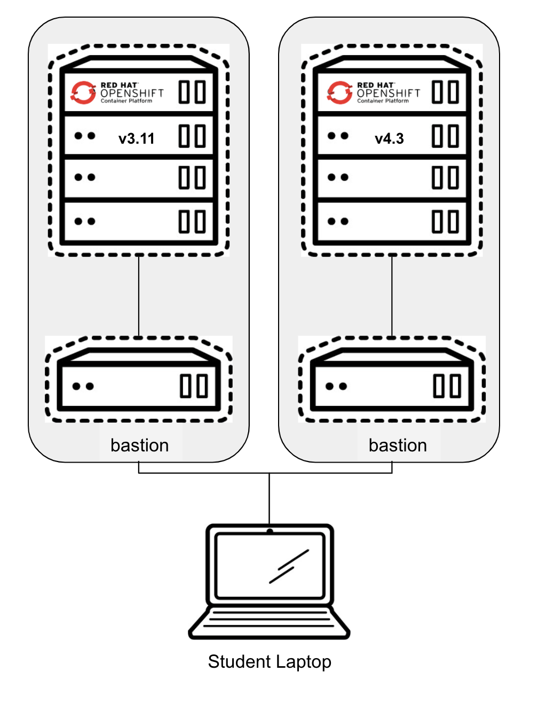

:OCP3_GUID: %OCP3_GUID%
:OCP3_DOMAIN: %OCP3_DOMAIN%
:OCP3_SSH_USER: %OCP3_SSH_USER%
:OCP3_PASSWORD: %OCP3_PASSWORD%
:OCP4_GUID: %OCP4_GUID%
:OCP4_DOMAIN: %OCP4_DOMAIN%
:OCP4_SSH_USER: %OCP4_SSH_USER%
:OCP4_PASSWORD: %OCP4_PASSWORD%

== Overview

The following lab environment has been provisioned for you for use with this Lab:

=== OpenShift 3.11 Cluster

[width="100%",cols="50%,50%",options="header",]
|===
|Key |Value
|GUID | {OCP3_GUID}
|OCP Console |https://master.{OCP3_GUID}.{OCP3_DOMAIN}/console
|Password |{OCP3_PASSWORD}
|API |https://master.{OCP3_GUID}.{OCP3_DOMAIN}
|Bastion Host |bastion.{OCP3_GUID}.{OCP3_DOMAIN}
|Bastion SSH |{OCP3_SSH_USER}/{OCP3_PASSWORD}
|===

=== OpenShift 4.3 Cluster

[width="100%",cols="50%,50%",options="header",]
|===
|Key |Value
|GUID | {OCP4_GUID}
|OCP Console |http://console-openshift-console.apps.cluster-{OCP4_GUID}.{OCP4_GUID}.{OCP4_DOMAIN}
|Password |{OCP4_PASSWORD}
|API |https://api.cluster-{OCP4_GUID}.{OCP4_GUID}.{OCP4_DOMAIN}:6443
|Bastion Host |bastion.{OCP4_GUID}.{OCP4_DOMAIN}
|Bastion SSH |{OCP4_SSH_USER}/{OCP4_PASSWORD}
|===
