:markup-in-source: verbatim,attributes,quotes
:OCP3_GUID: %OCP3_GUID%
:OCP3_DOMAIN: %OCP3_DOMAIN%
:OCP3_SSH_USER: %OCP3_SSH_USER%
:OCP3_PASSWORD: %OCP3_PASSWORD%
:OCP4_GUID: %OCP4_GUID%
:OCP4_DOMAIN: %OCP4_DOMAIN%
:OCP4_SSH_USER: %OCP4_SSH_USER%
:OCP4_PASSWORD: %OCP4_PASSWORD%

== Migrate File-Uploader Application

The first application that we are going to migrate is a `file-uploader` application. The application consists of several front-end pods backed by a single RWX-mounted OCS3/Gluster volume. A single service/route load-balances requests across the front-end pods.

_RWX is a ReadWriteMany Access Mode for persistent volumes in which the volume can be mounted as read-write by many nodes._

This application has been pre-deployed on the your OCP 3.11 cluster. We will be migrating this application to our 4.3 cluster, including the state to OCS4/Ceph.

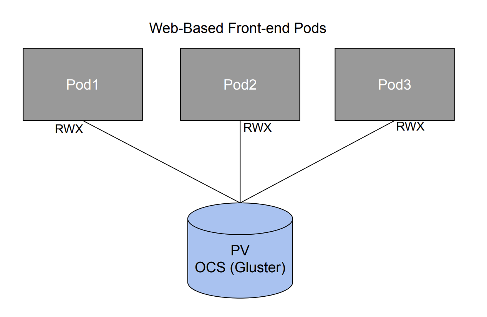

In the source 3.11 cluster terminal, let’s examine the application. Execute the following commands:

[source,subs="{markup-in-source}"]
--------------------------------------------------------------------------------
$ **oc get pods -n file-uploader**
NAME                    READY   STATUS      RESTARTS   AGE
file-uploader-1-build   0/1     Completed   0          44m
file-uploader-1-gbn49   1/1     Running     0          42m
file-uploader-1-ggjhj   1/1     Running     0          42m
file-uploader-1-rwlbt   1/1     Running     0          42m
--------------------------------------------------------------------------------

We can see the 3 replicas running. Next, let’s take a look at the storage:

[source,subs="{markup-in-source}"]
--------------------------------------------------------------------------------
$ **oc get pvc -n file-uploader**
NAME                      STATUS   VOLUME                                     CAPACITY   ACCESS MODES   STORAGECLASS        AGE
file-uploader-vol-claim   Bound    pvc-b660a697-6afe-11ea-a7fb-065ab8be0337   20Gi       RWX            glusterfs-storage   18h
--------------------------------------------------------------------------------

We can see that we do indeed have a 20GB Gluster volume mounted RWX to our application pods.

Next, let’s get the route to the application, and bring up the webUI.

[source,subs="{markup-in-source}"]
--------------------------------------------------------------------------------
$ **oc get route -n file-uploader**
NAME            HOST/PORT                                               PATH   SERVICES        PORT       TERMINATION   WILDCARD
file-uploader   file-uploader-file-uploader.apps.12a1.open.redhat.com          file-uploader   8080-tcp                 None
--------------------------------------------------------------------------------

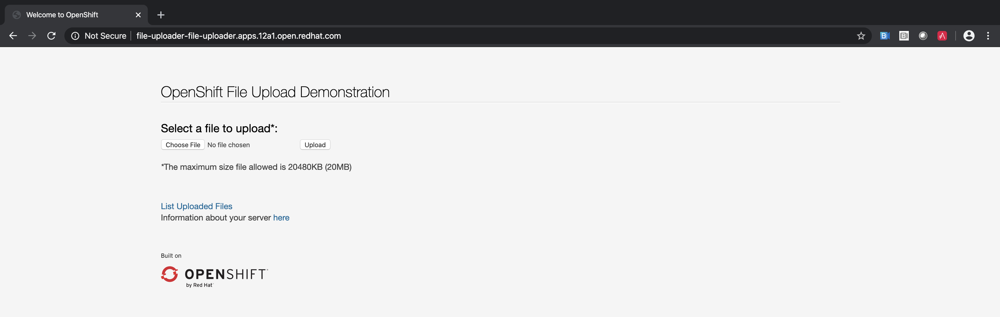

Lastly, let’s verify that the file-uploader application is *not* running on our destination OCP 4.3 cluster:

[source,subs="{markup-in-source}"]
--------------------------------------------------------------------------------
$ **oc get pods -n file-Uploader**
No resources found.
--------------------------------------------------------------------------------

=== Migrate with CAM

Next, let’s open up the migration UI. Again, to get the route, run the following command on the destination 4.3 cluster terminal:

[source,subs="{markup-in-source}"]
--------------------------------------------------------------------------------
$ **oc get routes migration -n openshift-migration -o jsonpath='{.spec.host}'**
migration-openshift-migration.apps.cluster-{OCP4_GUID}.{OCP4_GUID}.{OCP4_DOMAIN}
--------------------------------------------------------------------------------

The screen should look something like:

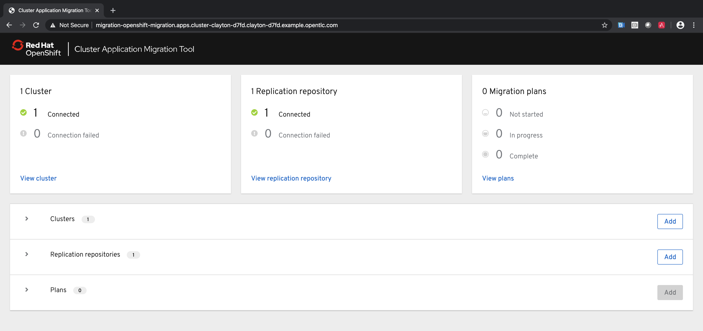

IMPORTANT: Remember our goal is to migrate our application from OCP/OCS 3 to OCP/OCS 4. This means moving our data from Gluster to Ceph. We will show you how to do this in CAM when setting up our migration plan.

==== Add a Cluster

First thing we want to do is add the source OCP cluster we wish to migrate the application from. Click `Add` on the Clusters section:

image:./screenshots/lab4/cam-add-cluster.png[CAM Add Cluster]

Fill out the necessary information. We will need an Service Account Token in order for destination cluster to talk to source cluster:

`Run the following in the 3.11 cluster terminal.`

[source,subs="{markup-in-source}"]
--------------------------------------------------------------------------------
$ **oc sa get-token -n openshift-migration mig**
eyJhbGciOifsfsds8ahmtpZCI6IiJ9fdsfdseyJpc3MiOiJrdWJlcm5ldGVzL3NlcnZpY2VhY2NvdW50Iiwia3ViZXJuZXRlcy5pby9zZXJ2aWNlYWNjb3VudC9uYW1lc3BhY2UiOiJtaWciLCJrdWJlcm5ldGVzLmlvL3NlcnZpY2VhY2NvdW50L3NlY3JldC5uYW1lIjoibWlnLXRva2VuLTdxMnhjIiwia3ViZXJuZXRlcy5pby9zZXJ2aWNlYWNjb3VudC9zZXJ2aWNlLWFjY291bnQubmFtZSI6Im1pZyIsImt1YmVybmss7gc2VydmljZWFjY291bnQvc2VydmljZS1hY2NvdW50LnVpZCI6IjQ5NjYyZjgxLWEzNDItMTFlOS05NGRjLTA2MDlkNjY4OTQyMCIsInN1YiI6InN5c3RlbTpzZXJ2aWNlYWNjb3VudDptaWc6bWlnIn0.Qhcv0cwP539nSxbhIHFNHen0PNXSfLgBiDMFqt6BvHZBLET_UK0FgwyDxnRYRnDAHdxAGHN3dHxVtwhu-idHKI-mKc7KnyNXDfWe5O0c1xWv63BbEvyXnTNvpJuW1ChUGCY04DBb6iuSVcUMi04Jy_sVez00FCQ56xMSFzy5nLW5QpLFiFOTj2k_4Krcjhs8dgf02dgfkkshshjfgfsdfdsfdsa8fdsgdsfd8fasfdaTScsu4lEDSbMY25rbpr-XqhGcGKwnU58qlmtJcBNT3uffKuxAdgbqa-4zt9cLFeyayTKmelc1MLswlOvu3vvJ2soFx9VzWdPbGRMsjZWWLvJ246oyzwykYlBunYJbX3D_uPfyqoKfzA

# We need to save the output of the 'get-token', that is the long string we will enter into the mig-ui when we create a new cluster entry.
--------------------------------------------------------------------------------

When done, click `Add Cluster`. You should see a `Connection successful` message. Click `Close`.

Now you should see the source and destination clusters populated.

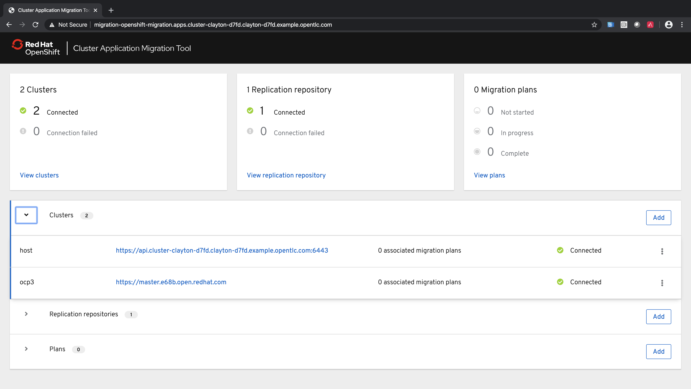

==== Create a Migration Plan

Now that we have a replication repository specified and both the source and destination clusters defined, we can create a migration plan. Click `Add` in the Plans section:

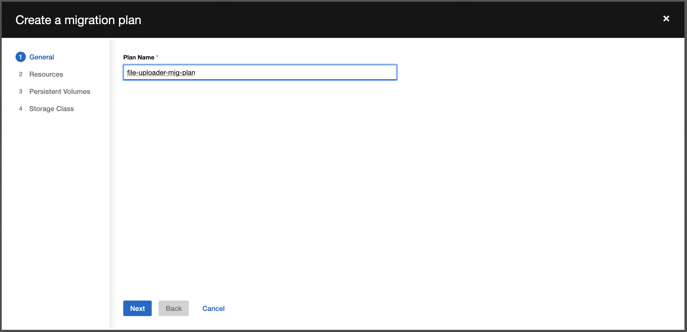

Fill out a plan name. Click Next.

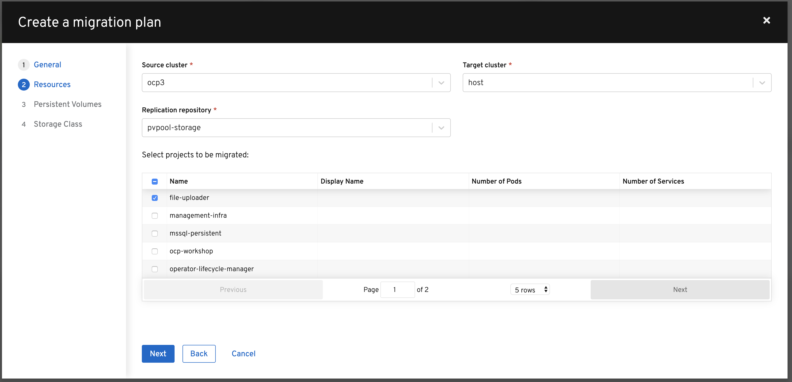

Select the source and target cluster, the replication repository, and the `file-uploader` namespace (which we want to migrate over). Click Next.

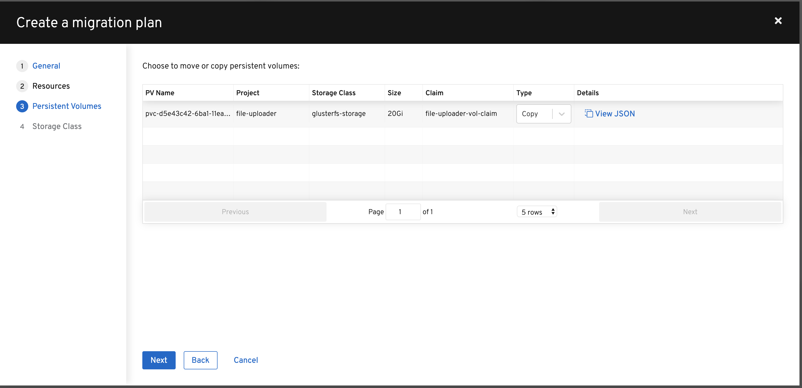

Now we are displayed the OCS3/Gluster persistent volume associated with our application. For this example, since we are migrating our storage from Gluster to Ceph, let’s choose `copy` as our transfer type.

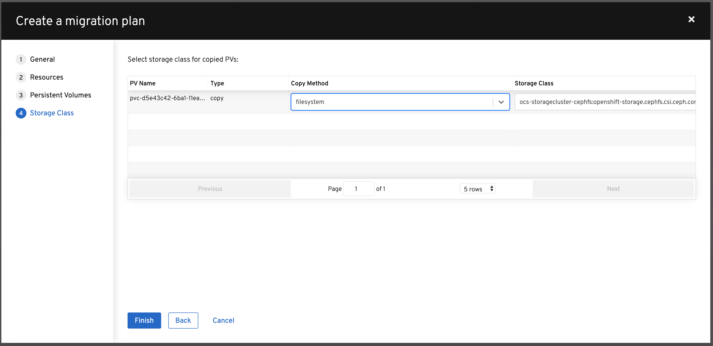

Next, we will need to select the `copy method` and destination `storage class`. CAM will attempt to pre-select these for you as defaults. In our case, we want *filesystem* and *ocs-storageclass-cephfs*.

Click Finish.

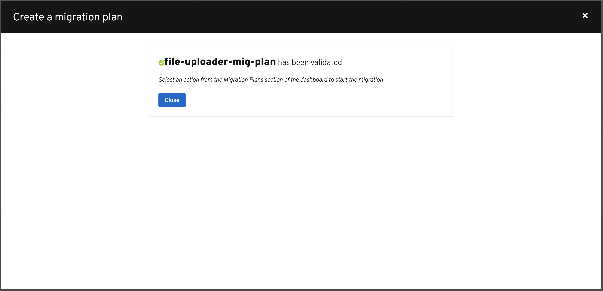

After the migration plan has been successfully validated, you can click `Close`.

==== Migrate the Application Workload

Now we can select `Migrate` or `Stage` on the application. Since we don’t care about downtime for this example, let’s select `Migrate`:

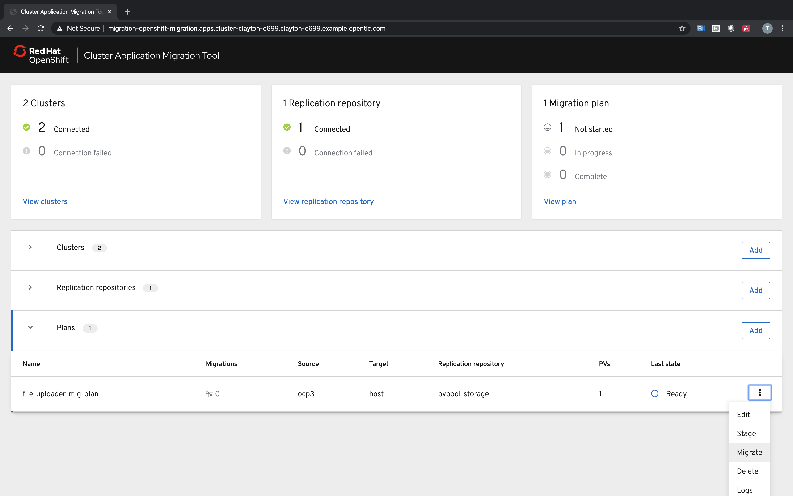

Optionally choose to _not_ terminate the application on the source cluster. Leave it unchecked and select `Migrate`.

image:./screenshots/lab4/cam-quiesce.png[CAM Quiesce]

The migration will progress with a progress bar showing each step in the process.

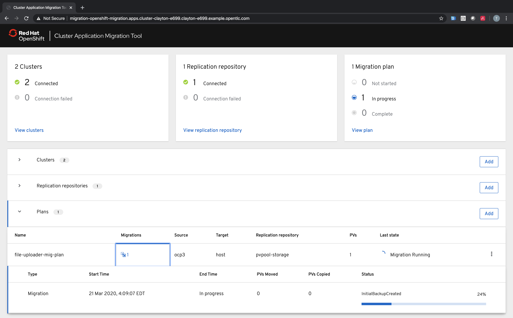

Once done, you should see `Migration Succeeded` on the migration plan.

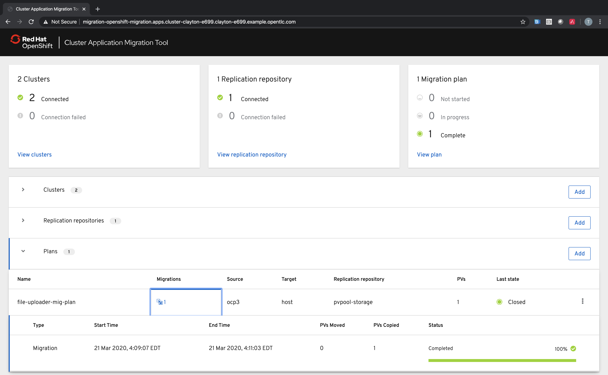

=== Verify Migrated Application

In the destination 4.3 cluster terminal, let’s execute the following commands:

[source,subs="{markup-in-source}"]
--------------------------------------------------------------------------------
$ **oc get pods -n file-uploader**
NAME                     READY   STATUS      RESTARTS   AGE
file-uploader-1-build    1/1     Running     0          96s
file-uploader-1-deploy   0/1     Completed   0          95s
file-uploader-1-rc49v    1/1     Running     0          93s
file-uploader-1-vf2pt    1/1     Running     0          93s
file-uploader-1-zbt6d    1/1     Running     0          93s
--------------------------------------------------------------------------------

We see that the file-uploader application is running.

Let’s check the storage:

[source,subs="{markup-in-source}"]
--------------------------------------------------------------------------------
$ **oc get pvc -n file-uploader**
NAME                      STATUS   VOLUME                                     CAPACITY   ACCESS MODES   STORAGECLASS                AGE
file-uploader-vol-claim   Bound    pvc-ff900007-c557-404c-852e-fca8bb4a5123   20Gi       RWX            ocs-storagecluster-cephfs   2m23s
--------------------------------------------------------------------------------

We see that our 20GB volume has been moved and is now running on Ceph.

Lastly, let’s grab the route and open up the WebUI in our browser.

[source,subs="{markup-in-source}"]
--------------------------------------------------------------------------------
$ **oc get route -n file-uploader**
NAME            HOST/PORT                                                                                PATH   SERVICES        PORT       TERMINATION   WILDCARD
file-uploader   file-uploader-file-uploader.apps.cluster-clayton-e699.clayton-e699.example.opentlc.com          file-uploader   8080-tcp                 None
--------------------------------------------------------------------------------

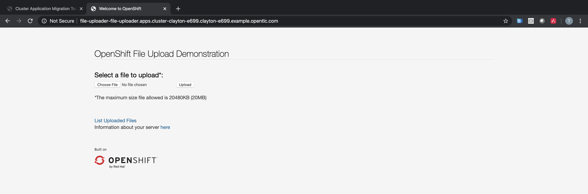

*Success!* You have now successfully migrated your first application using CAM.
