:markup-in-source: verbatim,attributes,quotes
:OCP3_GUID: %OCP3_GUID%
:OCP3_DOMAIN: %OCP3_DOMAIN%
:OCP3_SSH_USER: %OCP3_SSH_USER%
:OCP3_PASSWORD: %OCP3_PASSWORD%
:OCP4_GUID: %OCP4_GUID%
:OCP4_DOMAIN: %OCP4_DOMAIN%
:OCP4_SSH_USER: %OCP4_SSH_USER%
:OCP4_PASSWORD: %OCP4_PASSWORD%

== Migrate MSSQL Application

Next, we are going to migrate a simple Product Inventory web-based application front-end, backed backed by Microsoft SQL Server. This application has been pre-deployed on your 3.11 cluster in the mssql-persistent namespace, using a single PV backed by NFS for persistent storage.

In our source 3.11 cluster terminal, we can see the app running:

[source,subs="{markup-in-source}"]
--------------------------------------------------------------------------------
$ **oc get pods -n mssql-persistent**
NAME                                    READY   STATUS    RESTARTS   AGE
mssql-app-deployment-6ffb46c5d6-n5fvv   1/1     Running   0          41m
mssql-deployment-1-xq4p4                1/1     Running   0          41m
--------------------------------------------------------------------------------

Let’s get the route to the application, and bring up the webUI.

[source,subs="{markup-in-source}"]
--------------------------------------------------------------------------------
$  **oc get route -n mssql-persistent**
NAME              HOST/PORT                                                       PATH   SERVICES     PORT   TERMINATION   WILDCARD
mssql-app-route   mssql-app-route-mssql-persistent.apps.cd76.events.opentlc.com          db-app-svc   5000                 None
--------------------------------------------------------------------------------

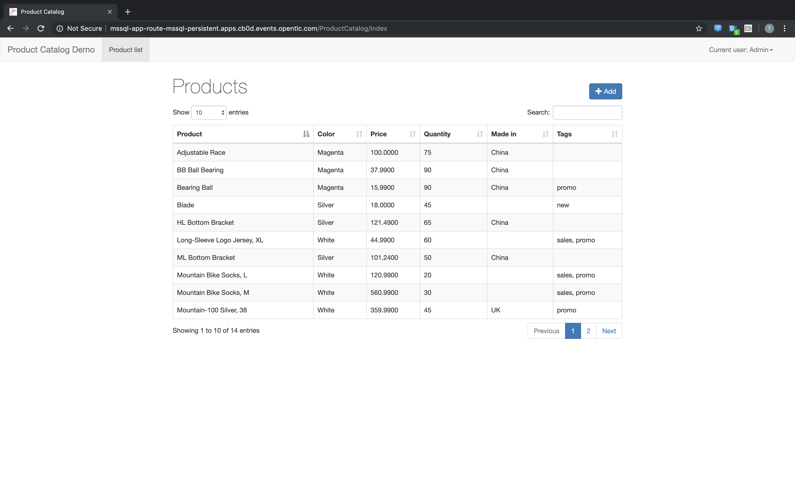

Let’s go ahead and add a new product to the inventory. Click on the +Add button and enter some data.

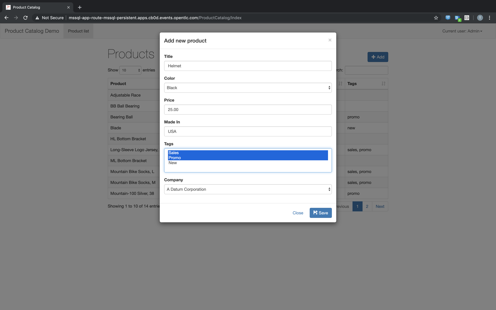

You can see the application is functioning and state is being saved in the DB.

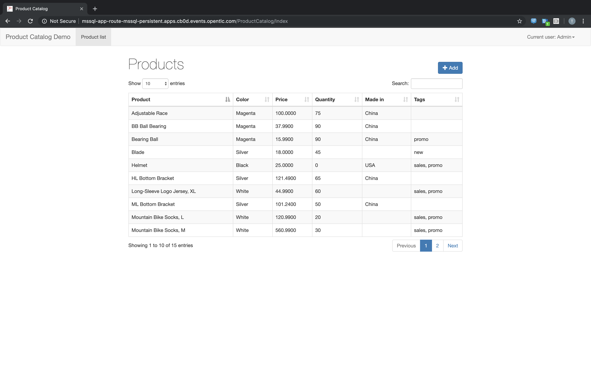

Let’s also verify that the application is NOT installed on our 4.3 destination cluster. You can see that no pods are running; and in fact the mssql-persistent namespace does _not_ exist.

[source,subs="{markup-in-source}"]
--------------------------------------------------------------------------------
$ **oc get pods -n mssql-persistent**
No resources found.
--------------------------------------------------------------------------------

=== Using CAM

Let’s go ahead and define our Migration Plan in the CAM UI.

==== Create a Migration Plan

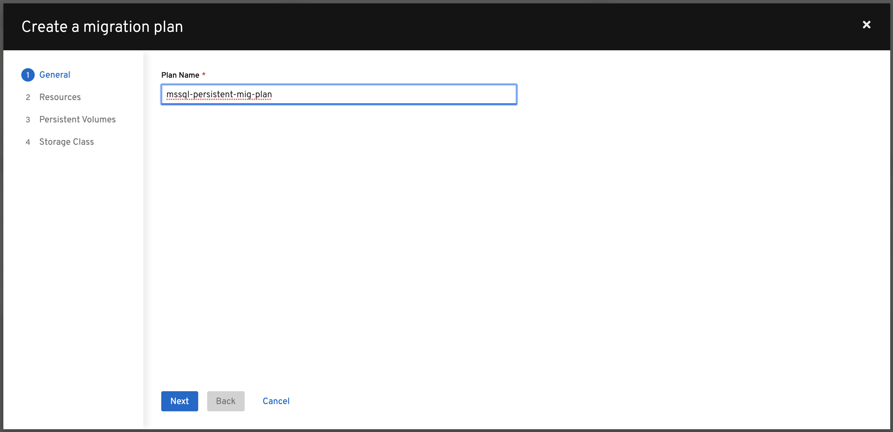

Fill out a plan name. Click Next.

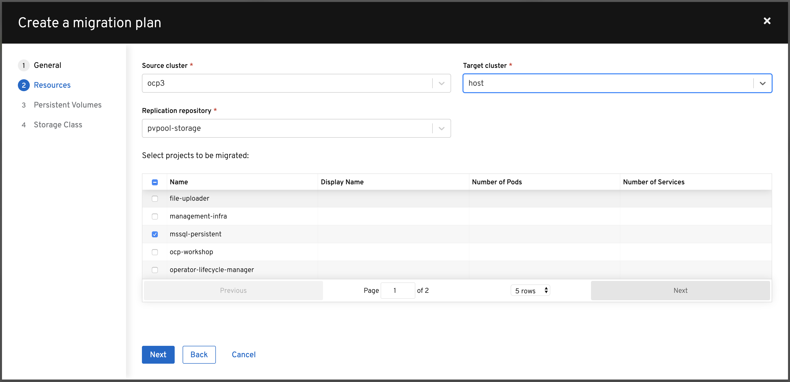

Select the source and target cluster, the replication repository, and the `mssql-persistent` namespace (which we want to migrate over). Click Next.

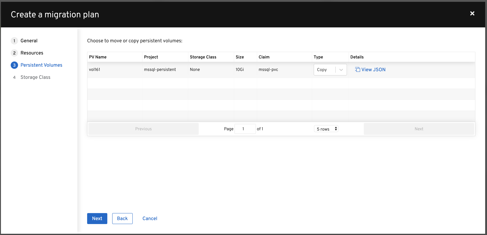

Now we are displayed a list of persistent volumes associated with our application workload. Select which type of action you would like to perform on the PV. For this example, let’s select `copy`. Click Next.

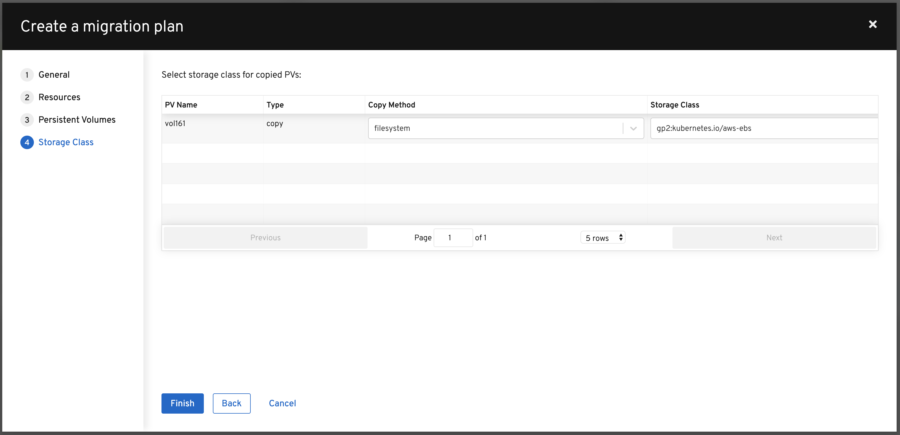

Select the storage class for your PVs. In this case we will be copying our data from NFS to AWS-EBS (`gp2:kubernetes.io/aws-ebs`). Click Next.

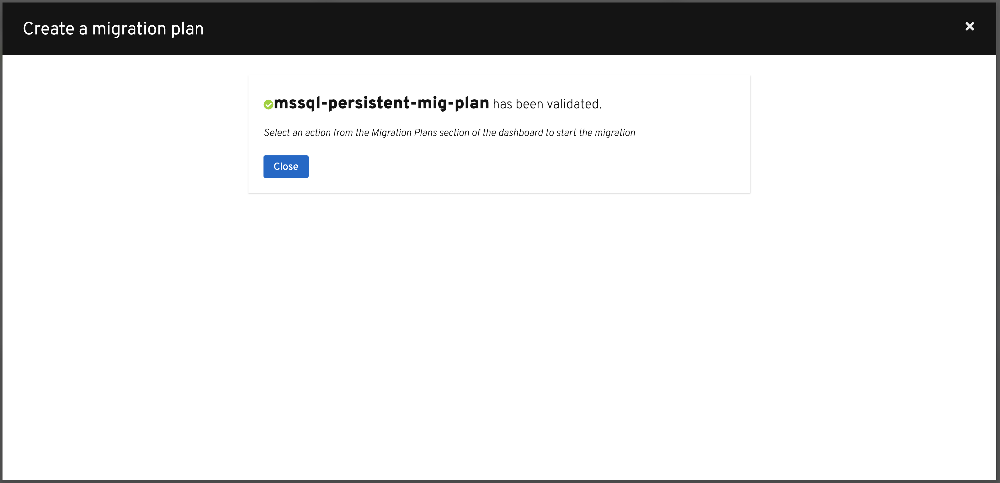

After validating the migration plan, you will see a `Ready` message and you can click `Close`.

==== Migrate the Application Workload

Now we can select `Migrate` or `Stage` on the application. Since we don’t care about downtime for this example, let’s select `Migrate`:

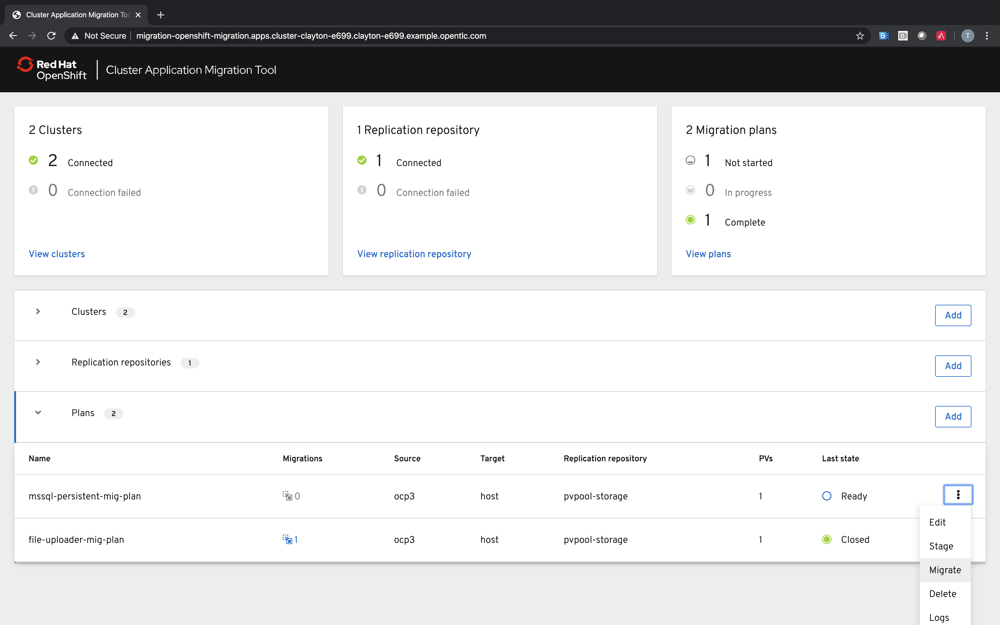

Optionally choose to _not_ terminate the application on the source cluster. Leave it unchecked and select `Migrate`.

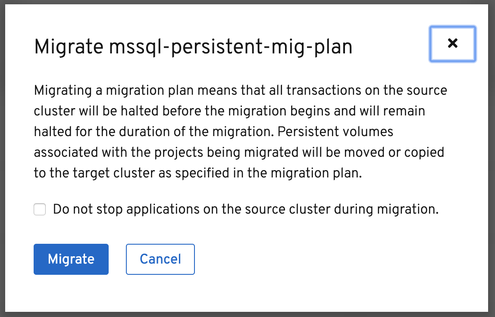

The migration will progress with a progress bar showing each step in the process.

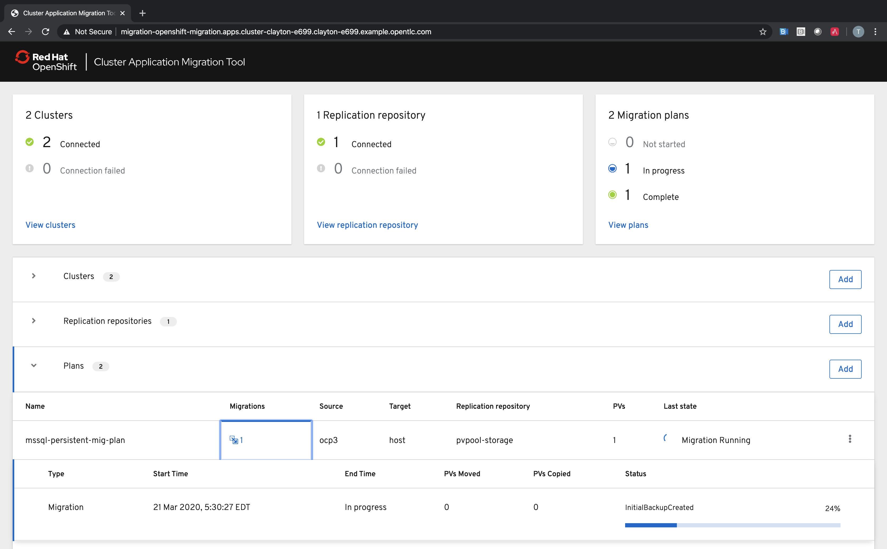

Once done, you should see `Migration Succeeded` on the migration plan.

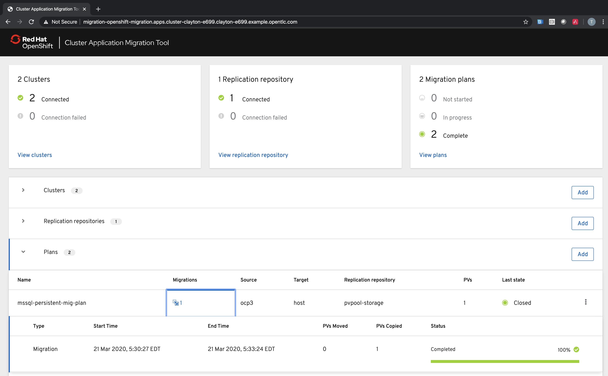

=== Verify Migrated Application

In the destination 4.3 cluster terminal, let’s execute the following commands:

[source,subs="{markup-in-source}"]
--------------------------------------------------------------------------------
$ **oc get pods -n mssql-persistent**
NAME                                    READY   STATUS      RESTARTS   AGE
mssql-app-deployment-7cc7954fd8-swlkx   1/1     Running     0          3m55s
mssql-deployment-1-deploy               0/1     Completed   0          3m58s
mssql-deployment-1-wllln                1/1     Running     0          3m55s
--------------------------------------------------------------------------------

We see that the mssql-persistent application is running.

Let’s check the storage:

[source,subs="{markup-in-source}"]
--------------------------------------------------------------------------------
$ **oc get pvc -n mssql-persistent**
NAME        STATUS   VOLUME                                     CAPACITY   ACCESS MODES   STORAGECLASS   AGE
mssql-pvc   Bound    pvc-c0e077ea-e1c7-4ba7-a48e-051de94296fa   10Gi       RWO            gp2            4m52s
--------------------------------------------------------------------------------

We see that our 10GB volume has been moved and is now running in AWS EBS.

Lastly, let’s grab the route and open up the WebUI in our browser, and verify that the product we added prior to migration still exists.

[source,subs="{markup-in-source}"]
--------------------------------------------------------------------------------
$ **oc get routes -n mssql-persistent**
NAME              HOST/PORT                                                    PATH   SERVICES            PORT    TERMINATION   WILDCARD
mssql-app-route   mssql-app-route-mssql-persistent.apps.034f.open.redhat.com   /      mssql-app-service   <all>                 None
--------------------------------------------------------------------------------

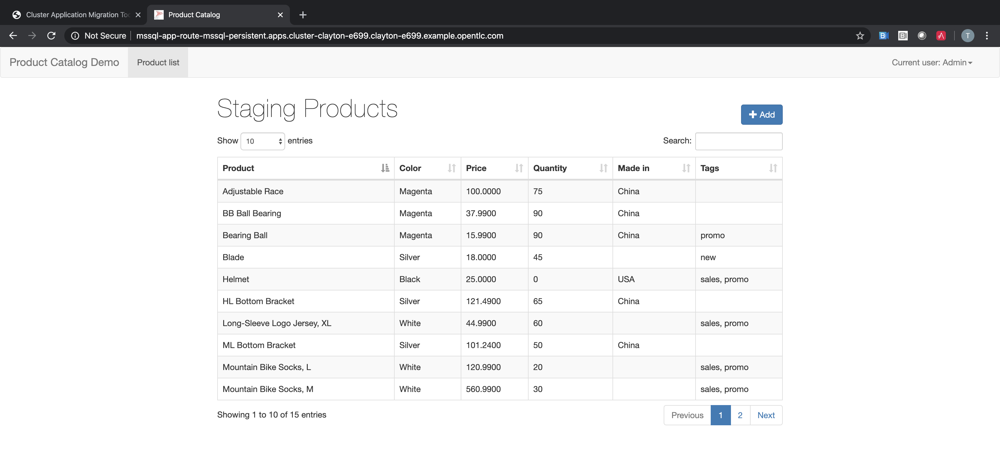
