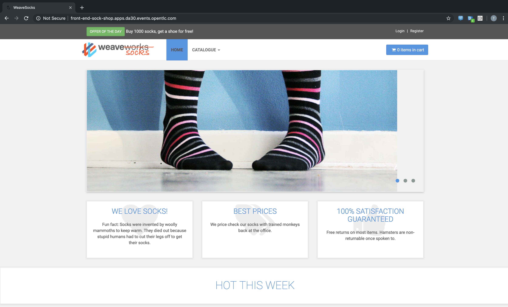
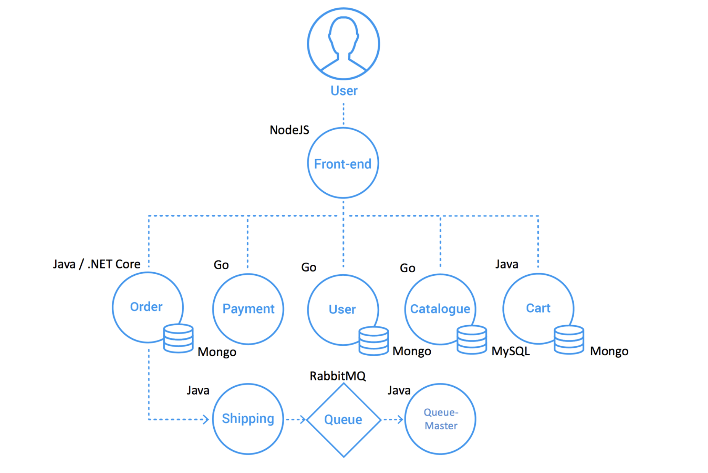

:markup-in-source: verbatim,attributes,quotes
:ocp3_guid: %ocp3_guid%
:ocp3_domain: %ocp3_domain%
:ocp3_ssh_user: %ocp3_ssh_user%
:ocp3_password: %ocp3_password%
:ocp4_guid: %ocp4_guid%
:ocp4_domain: %ocp4_domain%
:ocp4_ssh_user: %ocp4_ssh_user%
:ocp4_password: %ocp4_password%

== Migrate Sock-Shop Application

ACME Corporation is in the process of upgrading the production environment of their online socks store from OCP 3 to OCP 4. The application consists of various micro-services, and uses a shared NFS cluster for storage. ACME has already installed the 4.3 cluster, and you have been asked to migrate the Socks-Shop application from their 3.11 environment.

The application and all of it’s resources are contained within the `sock-shop` namespace.

Rather than provide a step-by-step walkthrough as we have in the previous two labs, you’ll be on your own for this round.

The high-level steps are as follows:

[arabic]
. Launch the CAM WebUI.
. Add a new Migration Plan.
. Be sure to specify `Move` vs Copy for the Persistent Volume transfer option; as we will be swinging the PVs to the new cluster but leaving the NFS storage as is.
. Execute a `Migration` of the Plan.
. Verify the application is functioning on the destination cluster.

Next, we’ve added a lab covering multi-namespace migrations and using the API directly for large scale operations.
